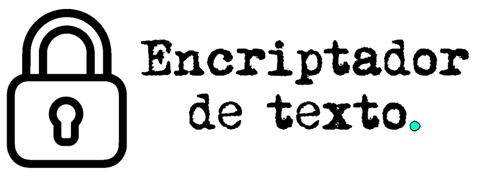
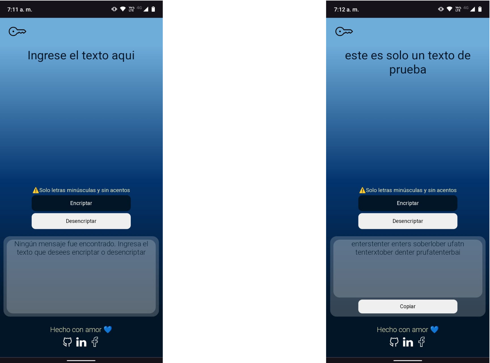

------------

   

------------

### Descripción del Proyecto! 🔒

- Su funcionamiento es muy sencillo, ya que solo cuenta con dos botones visibles todo el tiempo (Encriptar / Desencriptar). Y un tercer botón que aparece o desaparece dependiendo de si hay o no texto de salida disponible para copiar.
- La caja de texto principal recibe un texto normal para pasarlo por una función encargada de encriptarlo.
- De igual manera la caja de texto puede recibir un mensaje previamente encriptado y devolverlo como un texto normal.
- Este es mi primer proyecto Frontend, por lo tanto es muy básico, unicamente contiene HTML, CSS y Javascript. 
- Ningún framework fué utilizado durante la construcción.
- Es 100% responsive ya que todo ha sido trabajado con medidas relativas y ha sido testeado en diferentes tamaños de pantallas.

